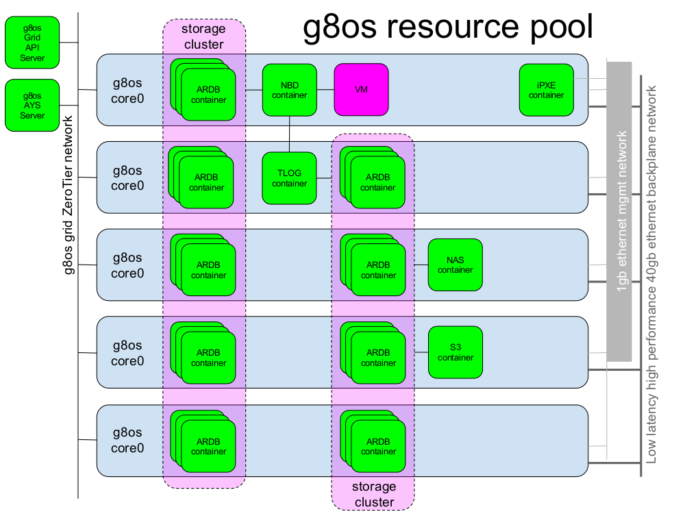

# resource pool
Stateless g8os resource pool api server

All documentation is in the [`/docs`](./docs) directory, including a [table of contents](/docs/SUMMARY.md).

Architecture:

## API:
specs : https://cdn.rawgit.com/g8os/resourcepool/5c7d6a1f/raml/api.raml
