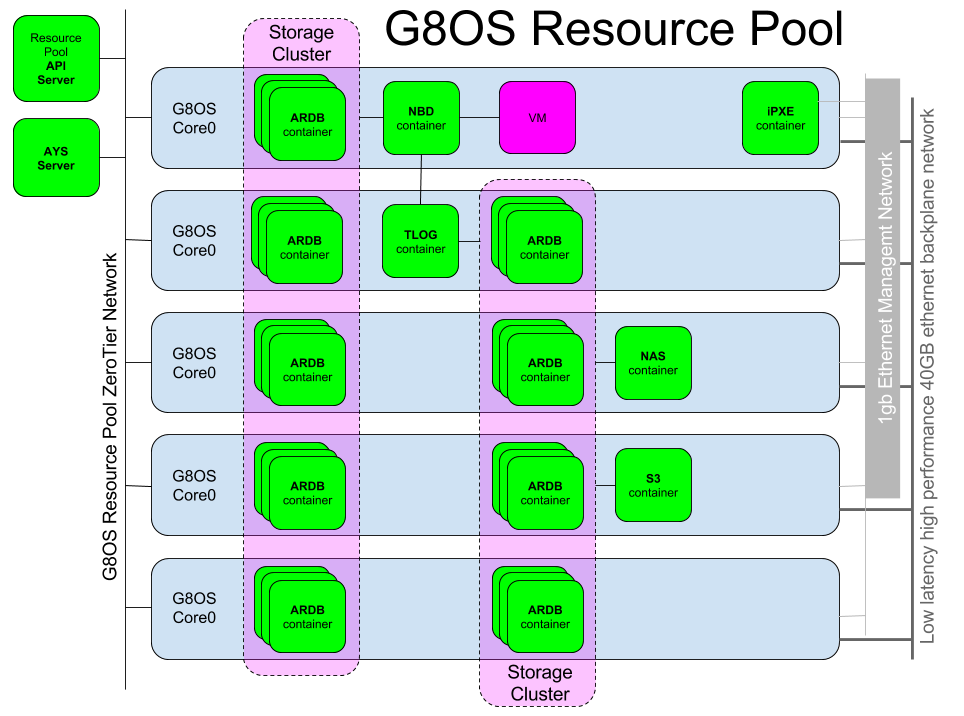

# Zero-OS Orchestrator

The Zero-OS Orchestrator is the REST API server for managing a cluster of Zero-OS nodes.

In the below picture you see a Zero-OS cluster of 5 physical nodes, all running Zero-OS, and all connected through a ZeroTier network.

Next to the the Zero-OS nodes, a Zero-OS cluster includes the following components:
- **Zero-OS Orchestrator**, exposing all the REST APIs to manage and interact with the Zero-OS cluster
- **AYS Server**, for managing the full lifecycle of both the Zero-OS cluster and the actual workloads (applications)
- **iPXE Server** from which all Zero-OS nodes boot

Both the **Zero-OS Orchestrator**, the **AYS Server** and the **iPXE Server** run in a container on one of the Zero-OS nodes, or on any other local or remote host, connected to the same ZeroTier network as the other Zero-OS nodes in the cluster.

In addition a Zero-OS cluster typically hosts (as a workload) one or more **Storage Clusters**, implemented as clusters of (ARDB) key-value stores running in containers hosted on the Zero-OS nodes. In the above picture two storage clusters are shown:
- One for implementing a block storage backend, exposed through NBD servers, one for each each virtual machine using virtual disks from the block storage backend
- Another one implementing the backend for the TLOG server, needed by the NBD servers

Furthermore the above setup shows a NAS server and a S3 server, both running in a container, and both connected to the second storage cluster, the same one that is used by the TLOG server.

For more details see:
* [Setting up the Zero-OS cluster](setup/setup.md)
* [Zero-OS Orchestrator REST API](api.md)
* [Storage Cluster](storagecluster/storagecluster.md)
* [Block Storage](blockstorage/blockstorage.md)

Or see the full [table of contents](SUMMARY.md) for other topics.

In [Getting Started with Zero-OS Orchestrator](gettingstarted/gettingstarted.md) you find a recommended path to get quickly up and running.
