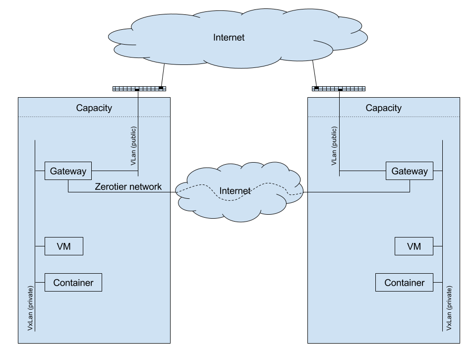

## Zero-OS Gateway

Discussed here:
- [What is the Gateway?](#what-is-the-Gateway)
- [DHCP service](#dhcp-service)
- [Port forwarding](#port-forwarding)
- [Reverse proxying](#reverse-proxying)
- [Advanced modus](#advanced-modus)
- [Cloud-init](#cloud-init)
- [V(x)Lan to V(x)Lan bridge](#vxlan-to-vxlan-bridge)

## What is the Gateway?

The Gateway is the networking Swiss army knife of the Zero-OS stack. It provides the following functions towards private V(X)LANs:
- DHCP service for handing out networking configuration to containers and virtual machines
- A firewalled public IP address
- Internet connectivity towards the containers and virtual machines in the VXLANs
- Port forwarding public IP traffic to hosted resources in the VXLAN
- Reverse proxying HTTP & HTTPS to hosted containers and virtual machines in the connected VXLANs
- Cloud-init server to initiate new virtual machines with passwords, SSH keys, configure swap, ...
- An OSI layer 2 bridge between remote VXLANs spread over different resource pools

A Gateway supports a mix of up to 100 network interfaces on VXLANs, VLANs, ZeroTier networks and bridges.
- V(X)LAN networks need to have distinct subnets, and will be routed automatically by the Gateway
- Routing configuration of connected ZeroTier networks needs to be handled in ZeroTier, as well as allowing the Gateway into the ZeroTier network (In case of a private ZeroTier network, when the token is not provided along with the ZeroTier network id)

## Creating a Gateway
Creating a Zero-OS Gateway is actually fairly easy. By submitting a POST request to the Zero-OS Orchestrator as specified in the API docs, Gateways are created instantaneously:
See [../../raml/api.html#nodes_nodeid_gws_post](https://htmlpreviewer.github.io/?../../raml/api.html#nodes__nodeid__gws_post)

## DHCP service
After the Gateway has been created, additional hosts can be added using the RESTful API of the Orchestrator. See [../../raml/api.html#nodes_nodeid_gws_gwname_dhcp_interface_hosts_post](https://htmlpreviewer.github.io/?../../raml/api.html#nodes__nodeid__gws__gwname__dhcp__interface__hosts_post) to find out what needs to be posted to the Orchestrator for adding and removing hosts.

## Port forwarding
Exposing TCP/UDP based services hosted in the connected V(X)LAN networks is achieved via the port forwarding service of the Gateway. See [../../raml/api.html#nodes_nodeid_gws_gwname_firewall_forwards_post](https://htmlpreviewer.github.io/?../../raml/api.html#nodes__nodeid__gws__gwname__firewall_forwards_post) to find out what needs to be posted to the Orchestrator for adding and removing port forwards.

## Reverse proxying
The reverse proxy service in the Gateway can be used to expose HTTP(s) services hosted in the connected V(X)LANs. It can do SSL-offloading and act as a load balancer towards multiple HTTP servers.

## Advanced modus

### nftables
Advanced firewall rules can be configured by just posting the [nftables](https://en.wikipedia.org/wiki/Nftables) configuration file that will be used in the Gateway.

> **Important** to note is that when the advanced firewall configuration is set the port forwarding API as discussed above will no longer function. See [../../raml/api.html#nodes_nodeid_gws_gwname_advanced_firewall_post](https://htmlpreviewer.github.io/?../../raml/api.html#nodes__nodeid__gws__gwname__advanced_firewall_post) to find how to use the advanced firewall modus.

### Caddy
Advanced reverse proxy configuration can be configured by uploading the [Caddy](https://caddyserver.com/) configuration file onto the Orchestrator API.

> **Important** to note is that when the advanced reverse proxy configuration is set the reverse proxy API as discussed above will no longer function. See [../../raml/api.html#nodes_nodeid_gws_gwname_advanced_http_post](https://htmlpreviewer.github.io/?../../raml/api.html#nodes__nodeid__gws__gwname__advanced_http_post) to find out how to use the advanced reverse proxying modus.

## Cloud-init
The gateway also acts as a cloud-init server over HTTP. For more information on cloud-init see https://cloud-init.io/ && https://cloudinit.readthedocs.io.
The gateway implements the [Apache Cloudstack](https://cloudinit.readthedocs.io/en/latest/topics/datasources/cloudstack.html) datasource.

See [../../raml/api.html#nodes_nodeid_gws_gwname_dhcp_interface_hosts_post](https://htmlpreviewer.github.io/?../../raml/api.html#nodes__nodeid__gws__gwname__dhcp__interface__hosts_post) to learn how to configure cloud-init user-data and meta-data when adding hosts to a connected network of a gateway. Posting the cloud-init data needs to be done in **YAML** format. Many configuration examples can be found here: https://cloudinit.readthedocs.io/en/latest/topics/examples.html

## V(x)LAN to V(x)LAN bridge
Probably the coolest feature of the Gateway is this function. It allows to connect V(x)LANs in remote sites into one logical L2 network using a specially configured ZeroTier network. See [Network/spec_inter-vxlan-ZeroTier.md](../Network/spec_inter-vxlan-zerotier.md) for detailed information on how to configure the ZeroTier network.
The bridge can be configured by setting the `zerotierbridge` property of the V(x)LAN interface of the Gateway. For more information how to create the bridge, see [../../raml/api.html#nodes_nodeid_gws_post](https://htmlpreviewer.github.io/?../../raml/api.html#nodes__nodeid__gws_post)
