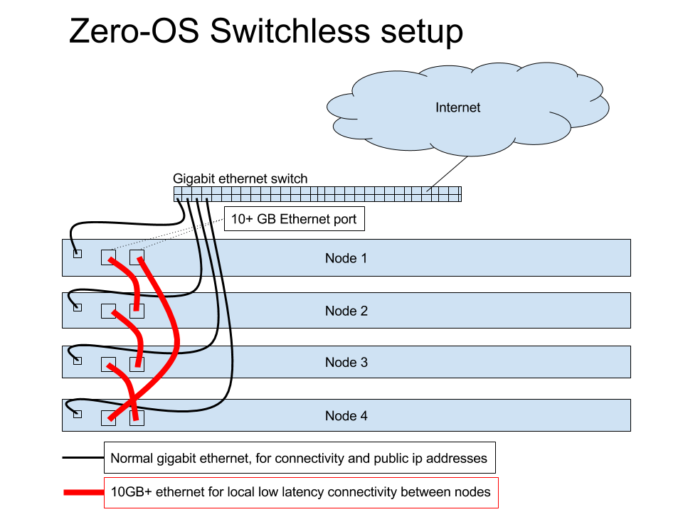

# Switchless Setup

With a maximum of 4 nodes it is possible to setup a Zero-OS cluster without the need for a 10GB+ Ethernet switch.

To accomplish this, connect the 10GB+ Ethernet ports as shown in the picture above. This setup also implies that the public networking is achieved over the normal Gigabit links instead of over the 10GB+ Ethernet network (which is used in normal G8 setups).

See step [4](README.md#setup-the-backplane-network) in [Setup a Zero-OS Cluster](README.md) on how to configure AYS for the switchless setup.
