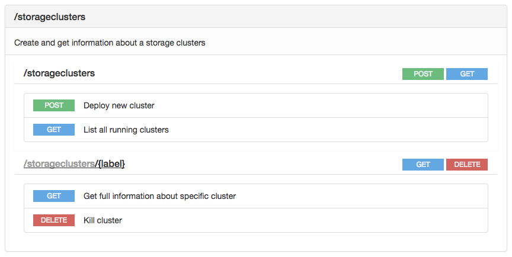

# Setup a Storage Cluster

Setting up a storage cluster is achieved through the Rest API exposed by the 0 Rest API Server.

So you first need to setup a Zero-OS  0 Rest API, as documented in [G8OS0 Rest APISetup](/docs/setup/setup.md).

Once the0 Rest APIis setup, following storage cluster API endpoint is exposed by the 0 Rest API Server:

Clicking **Post** will show you the details:

So the arguments to pass are:
- **label**: name the storage cluster
- **servers**: number of ARDB server to instantiate
- **driverType**: type of disk to use
- **slaveNodes**: if set to true, an extra slave ARDB server will be create for master ARDB server
- **nodes**: list of the nodes where the disks should be found

In the example shown above you will end up with a cluster of 256 master ARDB servers and another 256 slave ARDB servers using all SSDs in node1 and node2. So if each node has 6 SSDs that are not yet used, then you'll get 12 disk, used by 512 ARDBs. What actually will happen is that for each free SSD a new storage pool will be created. So each storage pool then includes on SSD disk.

Once you have a storage cluster setup it can be used for multiple purposes, most importantly for creating vdisks as discussed in [Block Storage](/docs/blockstorage/blockstorage.md).
